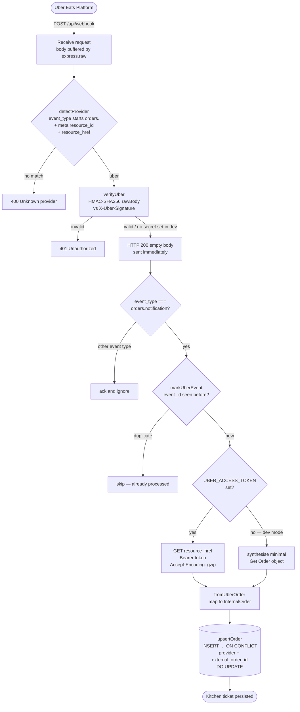
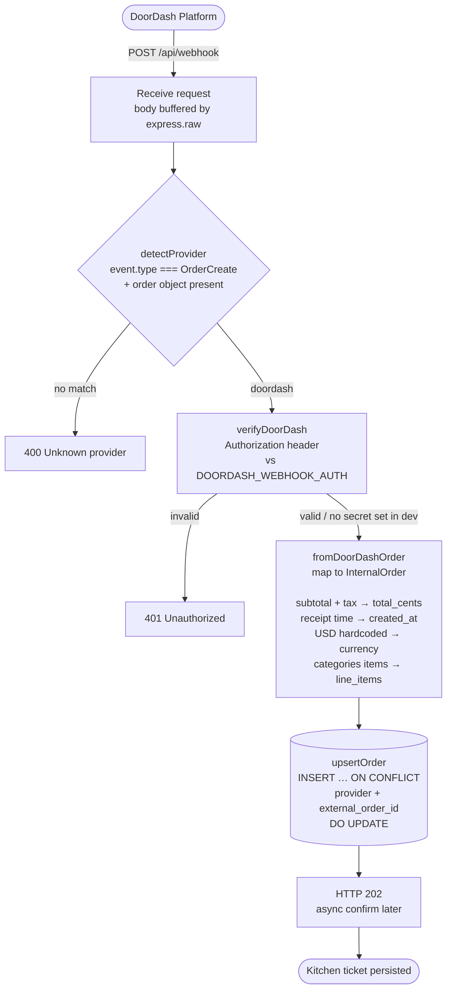
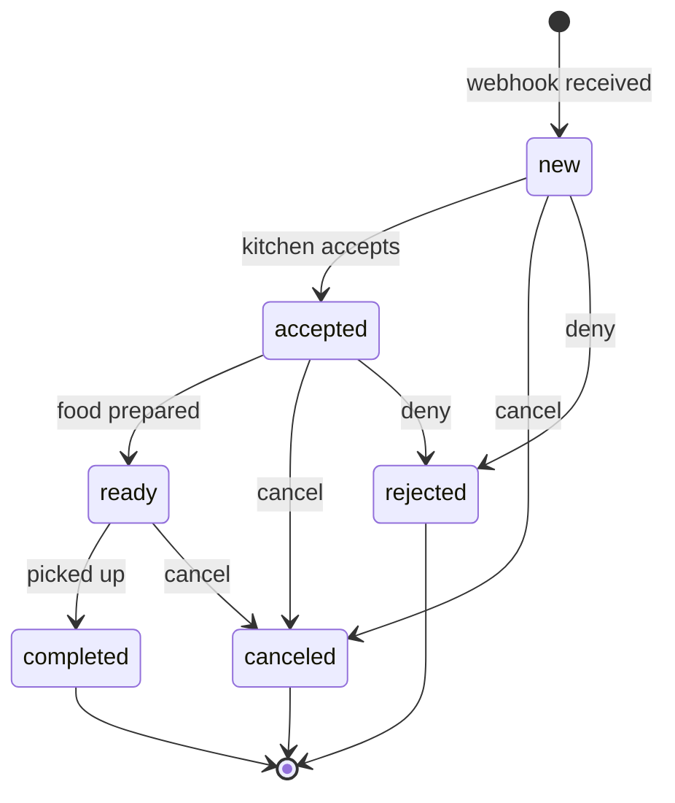
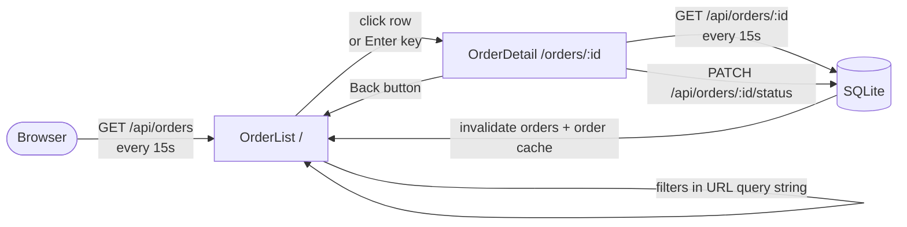

# System Walkthrough

## What it does

Two food delivery platforms (Uber Eats and DoorDash) each have their own webhook
format, authentication scheme, and order shape. This system accepts both on a
single HTTP endpoint, normalises them into one internal model, persists them to
SQLite, and surfaces them in a React admin UI as kitchen tickets.

---

## Repository layout

```
nomni/
├── api/src/
│   ├── index.ts        App bootstrap, body parsing, CORS, seed
│   ├── webhook.ts      POST /api/webhook — ingest endpoint
│   ├── auth.ts         Uber HMAC + DoorDash token verification
│   ├── normalise.ts    Provider payloads → InternalOrder
│   ├── orders.ts       GET/PATCH /api/orders routes
│   ├── store.ts        SQL read/write helpers
│   ├── db.ts           sql.js init + persist()
│   └── types.ts        Shared TypeScript types
├── admin/src/
│   ├── pages/OrderList.tsx    / — filterable order table
│   └── pages/OrderDetail.tsx  /orders/:id — line items + status advance
└── fixtures/
    ├── uber/webhook-orders-notification.json   thin webhook (IDs only)
    ├── uber/get-order-response.json            full order from Get Order API
    └── doordash/webhook-order-create.json      full order in one payload
```

---

## Uber Eats flow



---

## DoorDash flow



---

## Field mapping

### Uber Eats — Get Order response → InternalOrder

| Internal field | Uber field | Notes |
|---|---|---|
| `external_order_id` | `order.id` | Equals webhook `meta.resource_id`; log if they differ |
| `status` | `order.current_state` | CREATED→new, ACCEPTED→accepted, FINISHED→completed, DENIED→rejected, CANCELED→canceled |
| `customer` | `eater.first_name` + `last_name` | last_name is initial only per docs |
| `line_items[].name` | `cart.items[].title` | |
| `line_items[].quantity` | `cart.items[].quantity` | |
| `line_items[].unit_price_cents` | `cart.items[].price.unit_price.amount` | integer minor units |
| `total_cents` | `payment.charges.total.amount` | includes tax + fees |
| `currency` | `payment.charges.total.currency_code` | |
| `created_at` | `placed_at` | ISO 8601 |
| `raw_payload` | `{ webhook, order }` | both bodies stored |

### DoorDash — webhook order → InternalOrder

| Internal field | DoorDash field | Notes |
|---|---|---|
| `external_order_id` | `order.id` | needed for PATCH confirm |
| `status` | `event.status` | only NEW documented → new |
| `customer` | `consumer.first_name` + `last_name` | consumer.id is 64-bit int |
| `line_items[].name` | `categories[].items[].name` | nested under categories |
| `line_items[].quantity` | `categories[].items[].quantity` | |
| `line_items[].unit_price_cents` | `item.price` + Σ `extras[].options[].price × qty` | |
| `total_cents` | `subtotal + tax` | tips excluded |
| `currency` | not in payload | hardcoded USD |
| `created_at` | not in payload | webhook receipt time |
| `raw_payload` | full webhook body | |

---

## Order status lifecycle



Forward-only enforced in `PATCH /api/orders/:id/status`. Terminal states
(`canceled`, `rejected`, `completed`) block all further moves.

---

## Admin UI flow



- Filters (provider, status, search, sort) live in `useSearchParams` — preserved on back navigation
- Status advance calls `PATCH`, then React Query invalidates both caches — list updates without remount
- Raw `total_cents` and marketplace JSON only visible inside `<details>` debug section

---

## Authentication

| Provider | Scheme | Header | Dev skip condition |
|---|---|---|---|
| Uber | HMAC-SHA256 of raw body bytes, hex-encoded | `X-Uber-Signature` | `UBER_CLIENT_SECRET` unset |
| DoorDash | Shared secret bearer token | `Authorization` | `DOORDASH_WEBHOOK_AUTH` unset |

Uber raw body is captured by `express.raw` before JSON parsing so the bytes
are identical to what Uber signed. Comparison uses `crypto.timingSafeEqual`
to prevent timing attacks.

---

## Storage

SQLite via `sql.js` (pure JS — no native build). Single file at `api/orders.db`.

```
orders
  id                TEXT PRIMARY KEY
  provider          TEXT
  external_order_id TEXT
  status            TEXT
  customer          TEXT
  line_items        TEXT  (JSON)
  total_cents       INTEGER
  currency          TEXT
  created_at        TEXT
  raw_payload       TEXT  (JSON)
  UNIQUE(provider, external_order_id)   ← upsert key

uber_events
  event_id  TEXT PRIMARY KEY            ← dedup table for Uber retries
```

Every write calls `persist()` which synchronously flushes the in-memory
database to disk.
